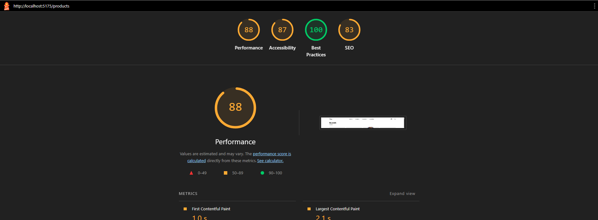

# SAE 301 - Galeries Lafayette

**Étudiant :** Wahel Gader  
**Itération :** 7  
**Site choisi :** Galeries Lafayette

**Port dev local :** 5175

---

## 📋 Description

Projet de refonte du site e-commerce Galeries Lafayette dans le cadre de la SAE 301. 

L'application comprend :
- ✅ Un système d'authentification (inscription/connexion)
- ✅ Un catalogue de produits avec filtres
- ✅ Un panier d'achat
- ✅ Un système de commande (Click & Collect)
- ✅ Gestion des commandes utilisateur
- ✅ Architecture MVC avec composants UI réutilisables

---

## 🛠️ Technologies

**Frontend :**
- Vite
- HTML
- JavaScript
- Tailwind CSS
- Architecture MVC

**Backend :**
- PHP
- MySQL
- REST API

---

## 🚀 Installation

### Base de données

1. Importer le fichier `SAE301.sql` dans votre serveur MySQL
2. Modifier les informations de connexion dans `api/src/Class/Controller.php`

### Backend (API)

Héberger le dossier `api/` sur votre serveur (ex: mmi.unilim.fr)

### Frontend

**Développement :**
```bash
cd client
npm install
npm run dev
```

**Production :**
```bash
npm run build
```

Héberger les fichiers du dossier `dist/` sur votre serveur

---

## 📁 Structure du projet

```
SAE301/
├── api/                    # Backend PHP
│   ├── src/
│   │   ├── Class/         # Entités (User, Product, Order...)
│   │   ├── Controller/    # Contrôleurs REST
│   │   └── Repository/    # Accès base de données
│   └── index.php
│
├── client/                 # Frontend
│   ├── src/
│   │   ├── pages/         # Pages de l'application
│   │   ├── ui/            # Composants UI réutilisables
│   │   ├── data/          # Gestion des données (Cart, Auth...)
│   │   ├── lib/           # Utilitaires (Router, API...)
│   │   └── layouts/       # Layouts de page
│   └── assets/            # Images, fonts...
│
└── SAE301.sql             # Base de données
```

---

## 🎯 Fonctionnalités

### User Stories implémentées

- **US01** : Consultation du catalogue produits
- **US02** : Filtrage et recherche de produits
- **US03** : Détail d'un produit
- **US04** : Inscription utilisateur
- **US05** : Connexion utilisateur
- **US06** : Ajout au panier
- **US07** : Passage de commande (Click & Collect)
- **US08** : Consultation de l'historique des commandes

---

## ⚡ Performance Lighthouse



---

## 🏗️ Architecture

### Frontend

Le frontend suit une architecture **MVC** .

**Composants UI** (`ui/`) :
- Chaque composant possède un `template.html` et un `index.js`
- Utilisation de placeholders `{{tag}}` remplacés par `genericRenderer()`
- Méthodes `html()` et `dom()` pour chaque composant

## 📝 Auteur

**Wahel Gader**  
SAE 301 - MMI Limoges
