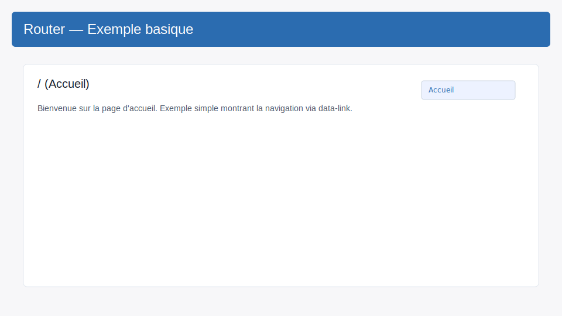
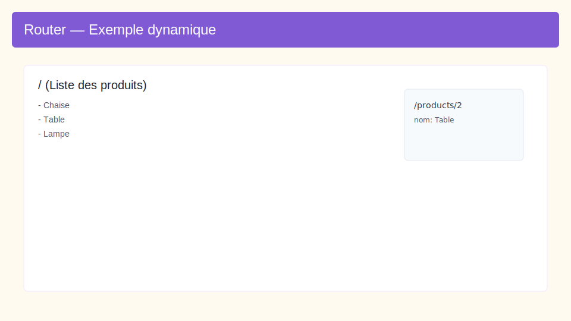
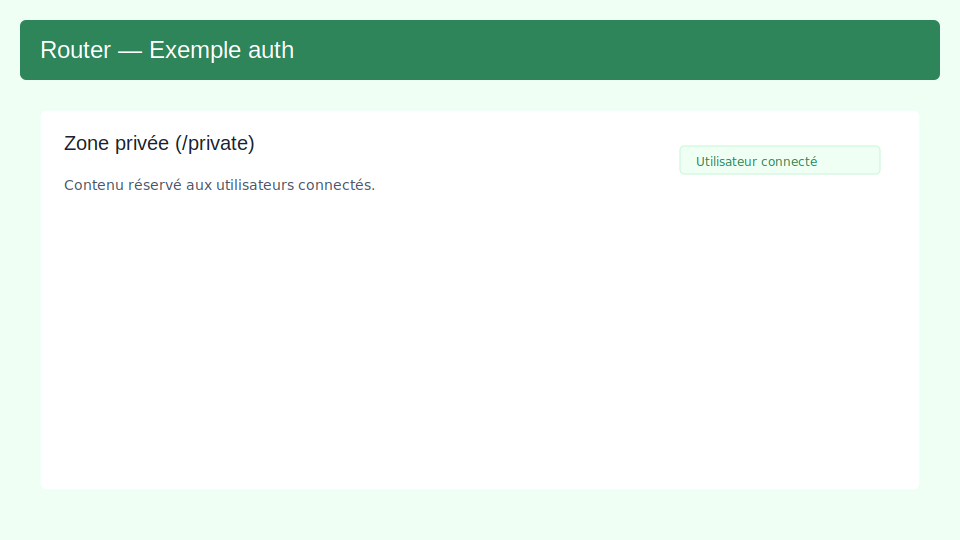

## Documentation — Classe Router

Cette documentation décrit la classe `Router` utilisée dans `client/src/lib/router.js`.
Elle couvre l'API publique, le comportement des routes dynamiques, la gestion de l'authentification (guards), des exemples d'utilisation et des bonnes pratiques.

### Vue d'ensemble

La classe `Router` est un routeur côté client minimaliste qui :

- gère des routes statiques et dynamiques (ex. `/products/:id`),
- supporte un comportement wildcard (`*`) pour la 404,
- intercepte les clics sur les liens marqués par l'attribut `data-link`,
- écoute l'événement `popstate` du navigateur pour la navigation arrière/avant,
- supporte une option de protection (requireAuth) pour certaines routes,
- offre des méthodes pour gérer l'état d'authentification et la redirection après login.

Fichier source : `client/src/lib/router.js`.

### Contrat (inputs / outputs / erreurs)

- Entrées principales :
  - appels à `addRoute(path, handler, options)` pour déclarer les routes,
  - navigation via `navigate(path)` ou via clics sur éléments avec `data-link`.
- Sorties :
  - les `handler` associés aux routes sont appelés avec un objet `params` (même vide si aucun param),
  - le routeur effectue des pushState et modifie `window.location`.
- Modes d'erreur :
  - si aucune route ne correspond, le handler de la route `'*'` (si déclaré) est appelé (404),
  - si une route protégée est demandée et que l'utilisateur n'est pas authentifié, le routeur redirige vers la page de login et mémorise la destination.

### Instanciation

Signature :

new Router(options = {})

Options disponibles :
- `loginPath` (string) — chemin de la page de connexion (défaut `/login`).

Exemple :

```javascript
import { Router } from '../lib/router.js';

const router = new Router({ loginPath: '/login' });
```

### API publique — méthodes

- addRoute(path, handler, options = {})
  - path (string) : route déclarée. Exemples : `'/'`, `'/products/:id'`, `'/search/:query*'`, `'*'` pour catch-all.
  - handler (function) : fonction appelée quand la route correspond; reçoit un objet `params`.
  - options (object) : actuellement supporte `requireAuth` (bool) — si true, l'accès nécessite d'être authentifié.
  - Retour : la même instance de router (pour chaînage).

- navigate(path)
  - Pousse `path` dans l'historique (`history.pushState`) et appelle `handleRoute()`.

- start()
  - Initialise le routeur en traitant la route courante (appel à `handleRoute`).

- setAuth(isAuth)
  - Définit l'état interne `isAuthenticated` (utile pour tests ou flux d'authentification externes).

- login()
  - Marque l'utilisateur comme authentifié (`setAuth(true)`), récupère une éventuelle route précédemment demandée depuis `sessionStorage.redirectAfterLogin` puis redirige vers cette route (ou `/`).

- logout()
  - Marque l'utilisateur comme déconnecté (`setAuth(false)`) et redirige vers `loginPath`.

### Comportement des chemins et paramètres

- Conversion en regex :
  - La méthode interne `pathToRegex(path)` transforme le `path` en expression régulière :
    - `/` devient `^\/$` (après échappement),
    - `:param` devient `([^\/]+)` (capture d'un segment sans slash),
    - `*` devient `.*` (wildcard),
    - si `path === '*'` la regex est `/.*/`.

- Extraction des noms de paramètres :
  - `extractParams(path)` renvoie un tableau de noms (ex. `['id']` pour `/products/:id`).

- Récupération des valeurs :
  - `getParams(route, path)` exécute la regex sur le `path` courant et associe les captures aux noms de paramètres. Renvoie `{}` si pas de match.

Exemples :

- Route : `/products/:id` et URL `/products/42` => handler appelé avec params `{ id: '42' }`.
- Route : `/users/:userId/orders/:orderId` et URL `/users/u1/orders/o2` => params `{ userId: 'u1', orderId: 'o2' }`.

Remarque : la conversion `:(\w+)` ne gère pas les paramètres avec caractères spéciaux dans le nom et considère uniquement des segments séparés par `/`.

### Navigation et intégration HTML

- Le routeur intercepte les clics sur tout élément qui correspond au sélecteur `[data-link]`.
  - Exemple de lien : `<a href="/products/42" data-link>Voir</a>`.
  - Lors d'un clic sur ce lien, la navigation est faite via `pushState` (pas de rechargement de la page).

- Le routeur écoute aussi `popstate` pour réagir aux navigation arrière/avant du navigateur.

### Authentification (guards)

- Lorsqu'une route a `requireAuth: true` et que l'état `isAuthenticated` est `false` :
  - le routeur stocke la destination demandée dans `sessionStorage.redirectAfterLogin` (clé littérale),
  - puis il redirige vers `loginPath`.

- Après authentification, appelez `router.login()` (ou `setAuth(true)` puis `navigate(...)`) pour vous reconnecter automatiquement au chemin sauvegardé.

Flux résumé :

- Un utilisateur non authentifié tente d'accéder à `/private` (route protégée)
- Router stocke `/private` dans `sessionStorage` et `navigate('/login')`
- Après authentification, `router.login()` redirige vers `/private` et efface la clé

### Exemple d'utilisation complet

```javascript
import { Router } from '../lib/router.js';

const router = new Router({ loginPath: '/login' });

router
  .addRoute('/', () => {
    // afficher la page d'accueil
  })
  .addRoute('/products/:id', ({ id }) => {
    // afficher les détails du produit id
  })
  .addRoute('/dashboard', () => {
    // dashboard protégé
  }, { requireAuth: true })
  .addRoute('/login', () => {
    // afficher le formulaire de connexion
  })
  .addRoute('*', () => {
    // 404
  });

// Démarrer
router.start();

// Exemple : connecter l'UI à l'état d'authentification
document.getElementById('loginButton').addEventListener('click', () => {
  // après validation des identifiants côté UI/API
  router.login();
});

document.getElementById('logoutButton').addEventListener('click', () => {
  router.logout();
});
```

### Cas limites et points d'attention

- Les noms de paramètres ne supportent pas les caractères autres que `\w` (lettres, chiffres, underscore). Si nécessaire, adaptez la regex.
- Les paramètres sont capturés segment par segment ; il n'y a pas de prise en charge native de segments optionnels (`/path/:id?`).
- Les routes sont testées dans l'ordre d'ajout : ajouter la route `'*'` à la fin.
- La gestion du `history` ne gère pas les états complexes (state object) — seule une navigation simple est implémentée.
- `sessionStorage` est utilisé pour mémoriser la redirection après login. Ce comportement suppose que le login se produit dans la même origine et session.

### Améliorations possibles

- Supporter des paramètres optionnels et des patterns plus riches (ex. `(:id)?`, `([^/]+?)` plus précis).
- Exposer des hooks ou événements (avantEach, afterEach) pour gérer l'autorisation asynchrone ou l'annulation de navigation.
- Ajouter la possibilité de réécrire l'URL sans pushState (pour certains usages), ou d'utiliser replaceState.
- Permettre des guards asynchrones retournant une promesse (utile si on doit vérifier un token auprès d'une API avant de permettre l'accès).

### Tests rapides / Vérifications

- Ouvrir l'application client (par ex. `client/index.html`) et vérifier :
  - cliquer sur un lien `<a data-link href="/products/1">` provoque l'appel du handler sans rechargement complet,
  - navigation via l'historique (boutons back/forward) déclenche les handlers grâce à `popstate`,
  - route protégée redirige vers `/login` quand `isAuthenticated` est `false`, puis `router.login()` renvoie à la destination.

  ### Exemples visuels

  Des exemples interactifs sont fournis dans `client/docs/examples/`. Ils démontrent :

  - un cas basique de navigation (`basic.html`),
  - un exemple avec route dynamique (`dynamic.html`),
  - un exemple de guard d'authentification et redirection après login (`auth.html`).

  Structure :

  client/docs/examples/
  - basic.html        — démonstration simple (accueil / about / 404)
  - basic.js
  - dynamic.html      — liste de produits + route `/products/:id`
  - dynamic.js
  - auth.html         — route protégée et flux de login/logout
  - auth.js

  Comment lancer les exemples (depuis le dossier `client`):

  ```bash
  # depuis la racine du projet
  cd client
  # lancer un serveur statique simple (port 8000)
  python3 -m http.server 8000

  # puis ouvrir dans le navigateur:
  # http://localhost:8000/docs/examples/basic.html
  # http://localhost:8000/docs/examples/dynamic.html
  # http://localhost:8000/docs/examples/auth.html
  ```

  Remarques :

  - Les exemples utilisent l'API History (`pushState`) pour mettre à jour `window.location.pathname`.
  - Au chargement, chaque exemple force une navigation initiale (`router.navigate('/')`) pour garantir un état cohérent même quand la page est servie depuis un sous-chemin.
  - Si vous rafraîchissez une URL custom (ex. `/products/2`) le serveur doit renvoyer le même HTML (config serveur nécessaire). Pour les tests locaux, utilisez les pages listées ci-dessus et naviguez via les liens fournis.

  Screenshots (exemples)

  

  Ce screenshot illustre la page d'accueil de l'exemple basique.

  

  Exemple montrant la liste des produits et la page de détails `/products/2`.

  

  Illustration du flux authentifié et de la zone privée.

  Générer vos propres captures

  1. Ouvrez l'exemple souhaité dans le navigateur (voir instructions ci-dessus).
  2. Naviguez vers l'écran à capturer (ex. ouvrir `/products/2` via le lien dans l'exemple dynamique).
  3. Utilisez l'outil natif de capture (Cmd+Shift+4 sur macOS) ou les DevTools > Device toolbar > Capture screenshot.
  4. Déposez les images dans `client/docs/images/` et mettez à jour les chemins dans ce document si nécessaire.

### Récapitulatif

La classe `Router` fournie est un routeur léger, adapté aux petites applications SPA. Elle fournit la plupart des primitives nécessaires : routes dynamiques, 404, interception de liens, et un mécanisme basique de guards. Pour des besoins plus complexes (guards asynchrones, sous-routes, lazy-loading), envisager d'étendre la classe ou d'utiliser une solution tierce.

Fichier source : `client/src/lib/router.js` — cette documentation est synchronisée avec l'implémentation trouvée dans ce fichier.
